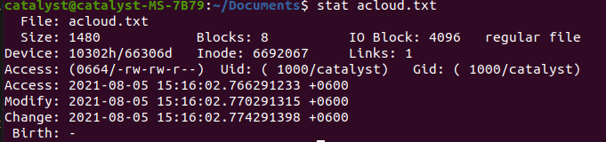
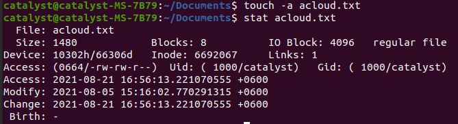
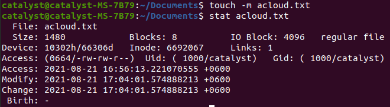
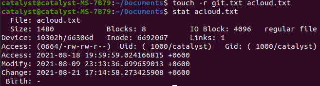
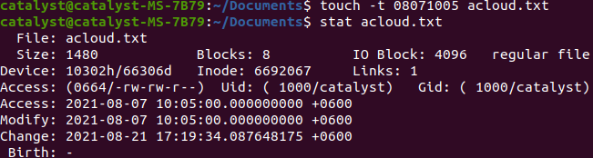
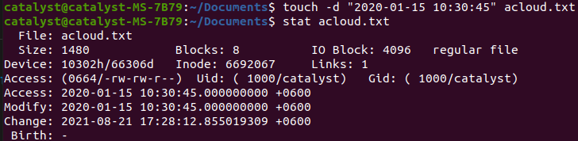

# touch Command
 we use touch command to create empty file/files
 ```console
 touch  test.txt
 ```
 will create a empty file named test.txt
<hr>

```console
touch test1.txt test2.txt test3.txt
or
touch test{1,2,3}.txt
```

To create multiple files using touch we can use above command
<hr>

touch command options are-
```
-a, change the access time only
-m, change the modification time only
-d, update access & modification time using specified time string
-r, use the acccess & modification time of another file
-t, update the access & modification times using specified time format
-c, if the file doesn't exist, don't create it
```

# Timestamp
**We Can Update Timestamp of files & folders using touch command**
* **Every linux file has three timestamp**
   * Access-time: The access timestamp is the last time a file was read.
   * Modification-time: A modified timestamp signifies the last time the contents of a file were modified. 
   * Change-time: Time at which the metadata related to a file was changed.
 <hr>

 **To view all timestamp of a file we use**
```
 stat filename
```
  

 # Change or Update Timestamp

```console
touch -a file1.txt
```
above command will change access time of the file if file wasn't there already file will be created.



form the image we can see access time of the file and also change time is updated. updating access or modification timestamp will also update change time automatically. **modification time is not updated**
<hr>

```console
touch -m file1.txt
```

above command will update modification timestamp of file1.txt



we can see from above image using `-d` option with touch command we can update modification timestamp, which will eventually update change timestamp too.

we can use `touch -am file1.txt` to update all timestamp of file1.txt file at once.
<hr>

```console
touch -c file1.txt
or
touch --no-create file1.txt
```

we can omit file creation using -c or --no-create option, if file1.txt already exist it will update all timestamp of the file. if file1.txt doesn't exist it won't create file1.txt, the command will do nothing.
<hr>

```console
touch -r fileA.txt fileB.txt
```

using `touch -r` we can reference onefiles timestamp into otherfile.



timestamp of git.txt is copied into acloud.txt, **change time is updated to current time**
<hr>

we can use `touch` command to update timestamp of a file with our specified time format

```console
touch -t 08071005 acloud.txt
```

format [[CC]YY]MMDDhhmm[.ss], [ ] means optional.



we can see that touch -t with specified timestamp, updated access and modification timestamp of acloud.txt with our desired timestamp, **change timestamp refers to current time**
<hr>

```console
touch -d "2020-01-15 10:30:45" acloud.txt
```
we can use `touch -d ` to update timestamp also but it accept timeformat as string



**access & modification timestamp for acloud.txt is updated to our given timestamp**