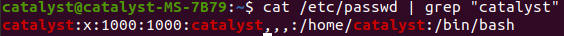
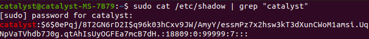
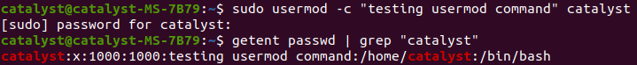
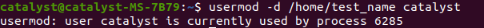
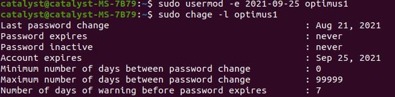

# User-Management

Whenever a new user is created These Things Happens,
 - Assigns a UID (unique id) to a user
 - Creates a folder of that user in home directory
 - Sets the default shell of the user to be /bin/sh
 - Creates a private user group, named after the username
 - .bashrc and .bash_logout are copied to the home directory of new user. These files provide environment variables for this user’s session.


# Passwd_File
All information related to user in linux system is stored in `/etc/passwd` file

Any user on the system has read access to this file but **only root has write access.**

This file consists of the following colon separated information about users in a system: 

- Username filed
- An 'x' in the second field indicated that encrypted password is stored in  /etc/shadow file.
- Unique User ID number.
- User's group number
- Additional records related to user
- Absolute path of user's home directory.
- Login shell of the user

```
cat /etc/passwd
```


`[username]:x:[UID]:[GID]:[GECOS]:[home_dir]:[shell_path]`

# Shadow_File

All encrypted password's are stored in `/etc/shadow` file

This file consists of the following colon separated information about password of users in a system:

- Username filed
- Password filed - contains encrypted password
- Last Password Changed in Epoch format




`[username]:[enc_pwd]:[last_pwd_change]:[pwd_validity]:[warn_date]:[acc_validity]:[acc_validity]:[acc_disablity]`
<hr>

## Different commands to view contents of `/etc/passwd` file

```console
less /etc/passwd
```

```console
getent passwd
```

`getent` command fetches user information from database configured in /etc/nsswitch.conf. file which also includes passwd database.
<hr>

```console
cut -d : -f1 /etc/passwd
```

`cut` command with `-d` delimeter ":" we can get fields `-f1` refers to first field or usernames
<hr>

```console
compgen -u
```

`compgen` with optin `-u` prints users without any additional informations
<hr>

```console
who
or 
whoami
```
prints information about current user
<hr>

```console
getent passwd | wc -l
```

prints total line in passwd file

# Usermod

`usermod` stands for modify user, we can use this command to modify user attributes through commandline

**information of a user is stored in following files**

- `/etc/passwd`
- `/etc/group`
- `/etc/shadow`
- `/etc/login.defs`
-` /etc/gshadow`

by using `usermod` command we modify above files, **`usermod` command requires root previlige**.

```console
sudo usermod -c "comment about user" username
```



we can see that GECOS filed for user `catalyst` is updated with the comment we provided, we can change user attribute of any user if we have root previlege.

<hr>

we can change userdirectory name for a particular user

```console
sudo usermod -d /home/new_userdirectoryname username
```

above command will change the the name of userdirectory. 

**NOTE: you can only change other users homedirctory not yours.**



we can also edit /etc/passwd file to change home directoy of a user
<hr>

we can also set or change expiry of a user using `usermod` command

```console
sudo usermod -e 20201-09-29 optimus1
```

To view expiry of a user-account

```console
sudo chage -l optimus1
```



