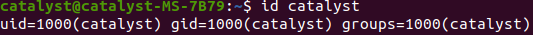
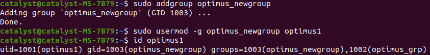
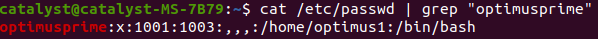
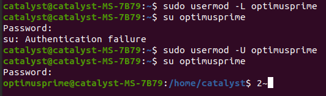
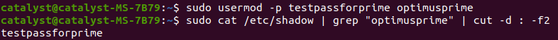
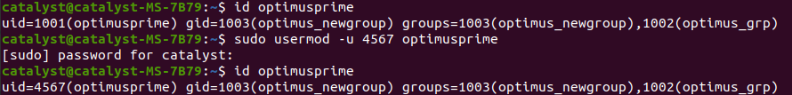

# User-Management

Whenever a new user is created These Things Happens,
 - Assigns a UID (unique id) to a user
 - Creates a folder of that user in home directory
 - Sets the default shell of the user to be /bin/sh
 - Creates a private user group, named after the username
 - .bashrc and .bash_logout are copied to the home directory of new user. These files provide environment variables for this user’s session.

# Frequently_Used_Commands
view group id and user id of an user
```console
id <username>
```


Add User

```console
sudo adduser <username>
```

change password of an user

```console
sudo passwd <username>
```
delete user **[if a group has only one user & that useraccount is deleted the group will get deleted automatically]**

```console
sudo deluser <username>
```

`deluser` can also be used to remove a user from group only without deleting user

```console
deluser <username> <groupname>
```

add group 

```console
addgroup <groupname>
```
delete group

```console
delgroup <groupname>
```

# Passwd_File
All information related to user in linux system is stored in `/etc/passwd` file

Any user on the system has read access to this file but **only root has write access.**

This file consists of the following colon separated information about users in a system: 

- Username filed
- An 'x' in the second field indicated that encrypted password is stored in  /etc/shadow file.
- Unique User ID number.
- User's group number
- Additional records related to user
- Absolute path of user's home directory.
- Login shell of the user

```
cat /etc/passwd
```


`[username]:x:[UID]:[GID]:[GECOS]:[home_dir]:[shell_path]`

# Shadow_File

All encrypted password's are stored in `/etc/shadow` file

This file consists of the following colon separated information about password of users in a system:

- Username filed
- Password filed - contains encrypted password
- Last Password Changed in Epoch format


`[username]:[enc_pwd]:[last_pwd_change]:[pwd_validity]:[warn_date]:[acc_validity]:[acc_validity]:[acc_disablity]`
<hr>

## Different commands to view contents of `/etc/passwd` file

```console
less /etc/passwd
```

```console
getent passwd
```

`getent` command fetches user information from database configured in /etc/nsswitch.conf. file which also includes passwd database.
<hr>

```console
cut -d : -f1 /etc/passwd
```

`cut` command with `-d` delimeter ":" we can get fields `-f1` refers to first field or usernames
<hr>

```console
compgen -u
```

`compgen` with optin `-u` prints users without any additional informations
<hr>

```console
who
or 
whoami
```
prints information about current user
<hr>

```console
getent passwd | wc -l
```

prints total line in passwd file

# Usermod

`usermod` stands for modify user, we can use this command to modify user attributes through commandline

**information of a user is stored in following files**

- `/etc/passwd`
- `/etc/group`
- `/etc/shadow`
- `/etc/login.defs`
-` /etc/gshadow`

by using `usermod` command we modify above files, **`usermod` command requires root previlige**.

```console
sudo usermod -c "comment about user" username
```


we can see that GECOS filed for user `catalyst` is updated with the comment we provided, we can change user attribute of any user if we have root previlege.

<hr>

we can change userdirectory name for a particular user

```console
sudo usermod -d /home/new_userdirectoryname username
```

above command will change the the name of userdirectory. 

**NOTE: you can only change other users homedirctory not yours.**


we can also edit /etc/passwd file to change home directoy of a user
<hr>

we can also set or change expiry of a user using `usermod` command

```console
sudo usermod -e <YYYY-MM-DD> <username>
```

To view expiry of a user-account

```console
sudo chage -l <username>
```


<hr>

we can change group of a user using `usermod` command

```console
sudo usermod -g <existinggroupname> <username>
```
To view changes

```console
id <username>
```

<hr>

we can change user login name using

```console
sudo usermod -l <newlogin> <oldloginname>
```

<hr>

We can **lock or disable a user**

```console
sudo usermod -L <username> 
```
To unlock user
```console
sudo usermod -U <username>
```



**during lock period we can't login to the locked user untill we unlock the user**
<hr>

we can **intentionally** set unencrypted passwod for a user

```console
sudo usermod -p <password> <username>
```
to view unencrypted password 

```console
sudo cat /etc/shadow | grep "<username>" | cut -d : -f2
```

<hr>

Bydefault when we create user a shell is binded to that user but we can manually do that too.

```console
sudo usermod -s /bin/sh <username>
```

Bydefault when we create useraccount an unique user id is assigned to that user, but if we want we can change that using usermod.

```console
sudo usermod -u <newuniqenumber> <username>
```


# Sudoers_File

By default, the first user created during the installation of Ubuntu is given the sudo privileges. It is given full root privileges and is added to the list of sudoers in the `/etc/sudoers` file.

We can add users to sudoers file to give an user admin previleges

```console
sudo vi /etc/sudoers
```
The easiest method to grant superuser permissions for mehedi is by adding the following line at the bottom of /etc/sudoers:

```console
<username> ALL=(ALL) ALL
```
here first ALL refers to host alias second ALL refers to Run alias third ALL refers to Command Alias

Basically it means `<username>` can run any commmand as any user in the host


we can restrict the list of commands that can be executed by a given user by grouping them into sets known as aliases.

```console
<username> ALL=(root) /usr/sbin/adduser, /usr/sbin/usermod
```
Now `<username>` will only able to use adduser and usermod command as super user

and won't be able to use any other command. by giving a user only permissions that they need  maintains **principal of least previlage access** 

We can user Command ALias group for reusability

e.g define an alias **[must be uppercase]** in bottom of sudoers file

```console
Cmnd_Alias USERMANAGEMENT = /usr/sbin/adduser, /usr/sbin/usermod
<username>    ALL=(root) USERMANAGEMENT
```

Now `<username>` will only be able to execute adduser,usermod command as super user.
